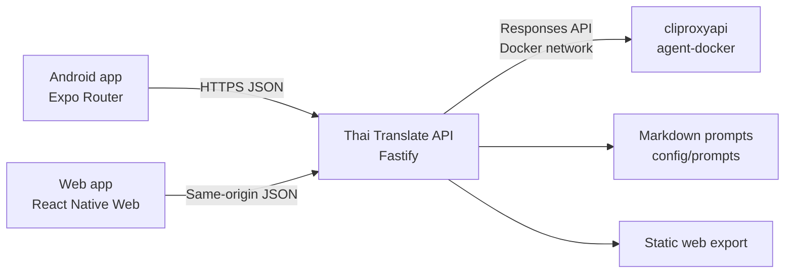

# Architecture

## Overview

Thai AI Translate is a universal TypeScript application with one React Native
interface for Android and web. Expo Router owns client routing and the production
web export. A separate Fastify backend protects credentials, loads versioned
Markdown prompts, and calls the existing CLIProxyAPI Responses endpoint.

The first release supports only Russian ↔ Thai. It has no translation history
or database. Device-local storage keeps the selected mode and speaker gender.



## Repository and Components

- `apps/client` contains the Expo SDK 57 application. The same translator screen,
  API client, preferences, validation types, and interactions run on Android and
  React Native Web.
- `apps/api` contains authentication, request validation, rate limiting, static
  web serving, prompt rendering, and the CLIProxyAPI adapter.
- `packages/contracts` is the shared Zod contract for request and response
  payloads, modes, gender, languages, and length limits.
- `config/prompts` is the only source of translation prompts. Prompt files are
  not exposed or editable in the UI and are loaded once during API startup.

The workspace uses pnpm and Node 24 LTS. Expo SDK 57 compiles Android against
SDK 36. Native `android/` and `ios/` projects are generated build artifacts and
are not versioned. The preview APK targets `arm64-v8a`; a universal four-ABI
artifact remains available through `pnpm --filter client build:android:universal`.

## Runtime Data Flow

1. The client validates that text is present, captures direction, mode, and
   speaker gender, then sends `POST /api/v1/translate`.
2. The API validates the body with the shared Zod schema and rejects text over
   2000 characters or an invalid language pair.
3. The prompt repository selects `farang-ploy.md` or `thai-formal.md` and
   substitutes source language, target language, and speaker gender.
4. The provider adapter sends a non-streaming, tool-free Responses API request
   to `gpt-5.6-terra` with `reasoning: none`, `store: false`, and a strict JSON
   schema.
5. The API validates the model result again and returns only translation,
   Thai text, Latin pronunciation, Russian pronunciation, and a request ID.
6. The client can copy the translation or pronounce `thaiText` through the
   device/browser Thai TTS voice.

No source text or translation is persisted. Application logs contain request
IDs, status, latency, and provider error category, but not user text or secrets.

## Public Interfaces

### `POST /api/v1/session`

Accepts `{ "pin": "..." }`. In production, a correct shared PIN returns a
30-day JWT and sets an HttpOnly, Secure, SameSite=Strict cookie. Android stores
the returned bearer token in SecureStore. Development can omit `APP_ACCESS_PIN`
and bypass authentication.

### `POST /api/v1/translate`

Request:

```json
{
  "text": "Спасибо",
  "sourceLanguage": "ru",
  "targetLanguage": "th",
  "mode": "thai-formal",
  "speakerGender": "male"
}
```

Response:

```json
{
  "translation": "ขอบคุณครับ",
  "thaiText": "ขอบคุณครับ",
  "pronunciation": {
    "latin": "khop khun khrap",
    "russian": "кхоп кхун кхрап"
  },
  "requestId": "..."
}
```

### `GET /healthz`

Returns process readiness and the configured model. It never calls the model or
returns credentials.

## Security and Failure Handling

- `CLIPROXYAPI_API_KEY`, access PIN, and JWT secret are server-only environment
  values. Expo public environment variables contain only the API origin.
- Production startup fails if the PIN or a 32-character session secret is
  missing. Translation and login routes have independent rate limits.
- The web app uses same-origin requests in production. CORS permits only the
  configured development origins; Android uses bearer authentication.
- The model receives no tools and is instructed to treat submitted text only as
  translation content. Strict structured output and Zod validation prevent
  arbitrary model output from crossing the API boundary.
- Validation errors use 400, authentication uses 401, refusal uses 422,
  provider errors use 502, and timeout uses 504. Public errors never contain
  upstream credentials or raw provider messages.

## Deployment

Local development runs the API container on the external
`agent-docker_agent-internal` network and calls
`http://cliproxyapi:8317/v1`.

Production is a separate Coolify project named `thai-ai-translate`. The
application joins Coolify's shared network, where the existing CLIProxyAPI
service is reachable by the `cliproxyapi` hostname. Coolify's proxy terminates
HTTPS and routes `translate.hetz.autismstaking.xyz` to port 3000. One production
container serves the exported Expo web files and `/api/*`, keeping browser
requests same-origin.

## Verification

- Contracts and API use Vitest with coverage thresholds and Fastify injection.
- Expo components use Jest, `jest-expo`, and React Native Testing Library.
- Playwright runs the complete web translation flow in desktop and mobile
  Chromium against a deterministic API fixture.
- Maestro installs and drives the Android APK on an emulator, translates
  `Спасибо`, and verifies Thai text and both pronunciations.
- A separate live smoke test calls the actual CLIProxyAPI for canonical phrases
  and checks required vocabulary and gender particles without expecting an
  entirely deterministic model sentence.

The root `pnpm verify` command runs lint, TypeScript checks, 39 unit tests,
six desktop/mobile Playwright scenarios, and both production builds. Android
Maestro and the live provider smoke test are explicit commands because they
require an emulator and a provider credential.
